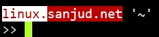
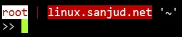

# promptstyle
Decorate your bash shell prompt

Add below lines in your profile file .bashrc to customized and colorize your prompt.
\
\
\
In this bash prompt *linux* is a hostname and *sanjud.net* is the domain name and last is the current working directory.\
+++++++++++++++++++++++++++++++++++++++++++++++++++\
` git clone -b style1 https://github.com/NgineerBabu/promptstyle `\
` cat promptstyle/style1 >> ~/.bashrc `\
` source ~/.bashrc `\
+++++++++++++++++++++++++++++++++++++++++++++++++++
\
\
\
\
In this bash prompt *root* is the user followed by separator pipe | *linux.sanjud.net* is the FQDN and last is the current working directory.\
+++++++++++++++++++++++++++++++++++++++++++++++++++\
` git clone -b style2 https://github.com/NgineerBabu/promptstyle `\
` cat promptstyle/style2 >> ~/.bashrc `\
` source ~/.bashrc `\
++++++++++++++++++++++++++++++++++++++++++++++++++
